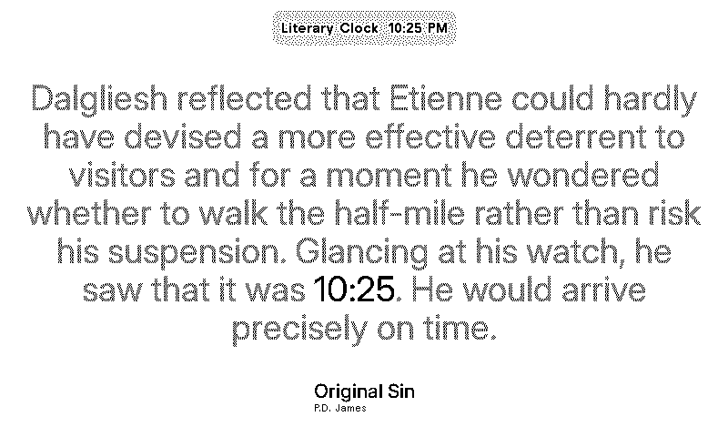

# Literary Clock TRMNL recipe

This self-contained TRMNL Recipe shows a book quotation containing the current
time. The time phrase is black and bold; the rest is grey. Installers can choose
All Books, Science Fiction, Fantasy, Romance, Mystery & Crime, Horror,
Historical Fiction, Classics, Children & Young Adult, Literary Fiction, or
Other.

It needs no API key, cloud worker, subscription, or always-on personal server.



## Data source

The Recipe embeds the English dataset from Carlos Bonadeo's MIT-licensed
[`literature-clock`](https://github.com/cdmoro/literature-clock). The source
contains 3,635 quotations. After filtering, this Recipe uses all 3,467 `sfw` or
`unknown` quotations, covering 1,410 of 1,440 minutes. It excludes `nsfw` and
`nswf` rows, chooses a stable quotation for each day and minute, and uses the
nearest available minute when necessary.

The build downloads the CSV from pinned commit
`cf83267d0ee007b87f235207be6741c4dc4a7e6e` and verifies SHA-256
`60393706e503a13be9548dc5c8c1d657b2d3be762dcbd906fa35191c575e6ef6`.
It writes compact JSON into `settings.yml`, including the upstream source,
checksum, and complete MIT notice. The final payload stays under 1 MB. Once
imported, the Recipe does not fetch data from GitHub or any other server.

The upstream repository licence does not by itself prove that every modern-book
excerpt is cleared by its rightsholder. Treat the inherited corpus as reviewable
third-party content and honour valid removal requests.

The original Instructables version generated one 600×800 PNG for every quote.
A PHP generator grew the text to fill the screen and made the time phrase bold;
a Kindle cron script selected a matching PNG each minute. This adaptation keeps
that visual idea but renders on demand from a larger maintained dataset.

## Genre data

`book_genres.json` is a compact build-time snapshot made from the first 3,000
works in nine Open Library subject indexes. Matching is deliberately strict:
the normalized title and author must both agree. The current snapshot matches
251 of 1,491 books. Unmatched or ambiguous books stay in **Other**.

Open Library subjects are community metadata, multi-label, and sometimes
surprising. The snapshot is cached, so an installed Recipe never calls Open
Library and a rebuild does not silently change classifications.

| Type | Books | Quotes |
| --- | ---: | ---: |
| Science Fiction | 51 | 161 |
| Fantasy | 45 | 121 |
| Romance | 29 | 125 |
| Mystery & Crime | 11 | 85 |
| Horror | 18 | 68 |
| Historical Fiction | 48 | 181 |
| Classics | 84 | 217 |
| Children & Young Adult | 56 | 181 |
| Literary Fiction | 19 | 57 |
| Other / unclassified | 1,240 | 2,690 |

To refresh the snapshot from a compatible quote CSV:

```sh
python3 update_book_genres.py quotes.en-US.csv book_genres.json
```

See [ADDING_BOOKS.md](ADDING_BOOKS.md) for the rights-screened way to add books
and correct genre metadata.

## Add it to TRMNL

Download `LITERARY_CLOCK_TRMNL_RECIPE.zip` from the
[latest GitHub release](https://github.com/saphid/trmnl-literary-clock/releases/latest),
or build the flat import archive:

```sh
./build-recipe-package.sh
```

Open TRMNL's **Private Plugin** settings, choose **Import new**, and select
`dist/LITERARY_CLOCK_TRMNL_RECIPE.zip`. Open the imported plugin's settings to
choose a book type. No URL or time-zone field is needed; TRMNL injects the
account's current UTC offset into the Liquid template.

To share it through TRMNL, open the imported plugin, choose **Publish**, then
select **Unlisted** for an immediate link or **Public** for directory review.
The GitHub release ZIP can also be shared directly.

## Timing limitation

TRMNL's hosted static Recipe generation currently refreshes no more often than
every 15 minutes. The quotation is correct when the screen is generated but may
remain until the next refresh. The local Kindle TRMNL service can still refresh
its Literary Clock screen every minute.
